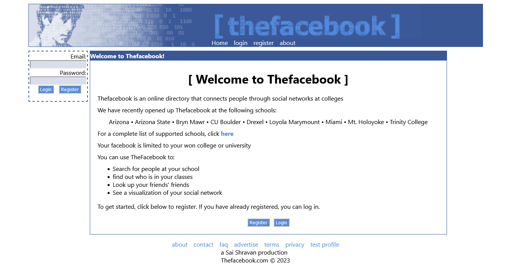

# React Facebook Clone

This project is a recreation of the first version of Facebook using React. It aims to replicate the basic functionalities and design of the original Facebook platform.

## Table of Contents

- [React Facebook Clone](#react-facebook-clone)
  - [Table of Contents](#table-of-contents)
  - [Features](#features)
  - [Installation](#installation)
  - [Usage](#usage)
  - [Contributing](#contributing)
  - [License](#license)
  - [Acknowledgments](#acknowledgments)

## Features

<!-- - User authentication: Sign up, log in, and log out functionalities. -->
- User Profiles: View and edit user profiles.
  <!-- - News Feed: Displaying posts from friends and users. -->
  <!-- - Friend Requests: Send and accept friend requests. -->
  <!-- - Likes and Comments: Like and comment on posts. -->

  ### The current version of the app in this repository might have some functionality issues that need to be addressed. Apologies for any inconvenience caused and want to ensure transparency regarding the known issues.

## Installation

1. Clone the repository: `git clone https://github.com/your-username/thefacebook.comclient.git`
2. Navigate to the project directory: `cd thefacebook.comclient`
3. Install the dependencies: `npm install`

## Usage

1. Start the development server: `npm start`
2. Open your web browser and visit `http://localhost:3000` to see the app in action.

## Contributing

Contributions are welcome! If you want to contribute to this project, please follow these steps:

1. Fork the repository.
2. Create a new branch: `git checkout -b feature/your-feature`
3. Make your changes and commit them: `git commit -m 'Add your feature'`
4. Push to the branch: `git push origin feature/your-feature`
5. Submit a pull request.

## License

This project is licensed under the [MIT License](https://opensource.org/licenses/MIT). Feel free to modify and distribute this code for personal or commercial purposes.

## Acknowledgments

- This project is inspired by the original Facebook platform.
- Thanks to the React community for providing an excellent framework for building user interfaces.

---
